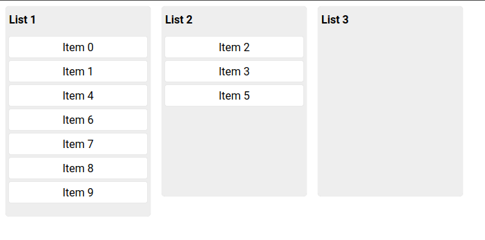

# react-lists-dnd

> Made with create-react-library

[](https://www.npmjs.com/package/react-lists-dnd) [](https://standardjs.com)

## Getting started
This package provide a simple kanban board drag and drop for ReactJS.
It's based on react-dnd.



* Install

```bash
npm install --save react-lists-dnd
```

* Import:
```tsx
import { Board, DataSource} from "react-lists-dnd";
```

* Define your Item component
```tsx
type ItemProps = {
    value: string
}

const Item: React.FunctionComponent<ItemProps> = (props) => <div> {props.value} </div>
```

* You can also use the default Item component if it suits your needs
```tsx
import { Item } from "react-lists-dnd";
```

* Create your lists
```tsx
const lists = [
    {
        listId: "1",
        title: "List 1"
    },
    {
        listId: "2",
        title: "List 2"
    }
]
```

* Define your Board initial Data
```tsx
const initialData: DataSource[] = [
    {
        listId: "1",
        dataId: "item-1",
        render: <Item value={"Item 1"} />
    },
    {
        listId: "2",
        dataId: "item-2",
        render: <Item value={"Item 2"} />
    }
]
```

* Define a callback function to retrieve data change on drops
```tsx
const onDataUpdate = (data: DataSource[]) => {
    // Do something with data
}
```

* Render the board component
```tsx
   <Board
     lists={lists}
     dataSource={initialData}
     onDataUpdate={onDataUpdate}
   />
```

### A complete Usage

```tsx
import * as React from 'react'
import { Board, Item, DataSource } from 'react-lists-dnd'


export function MyBoard() {

  // Each list is defined with an unique ID and a title
  const lists = [
    {
      listId: '1',
      title: 'List 1'
    },
    {
      listId: '2',
      title: 'List 2'
    },
    {
      listId: '3',
      title: 'List 3'
    }
  ]

  // Populate the board with random items
  const initialData: DataSource[] = []
  for (let i = 0; i < 10; i++) {
    initialData.push({
      dataId: `${i}`,
      listId: '1', // Each item is assign to a list with listId
      render: <Item> Item {i} </Item> // The rendered component for the item, You can use any JSX
    })
  }

  // CallBack function called when an item is drop
  const onDataUpdate = (data: DataSource[]) => {
    console.log(data)
  }

  return (
    <>
      {/* You can add style or className on Board for styling */}
      <Board
        lists={lists}
        dataSource={initialData}
        onDataUpdate={onDataUpdate}
      />
    </>
  )
}
```

## Status
Under active development, not tested with large dataset (more than 200 items). For more flexible solution you should directly use react-dnd or react-beautiful-dnd

## License

MIT © [gtindo](https://github.com/gtindo)
